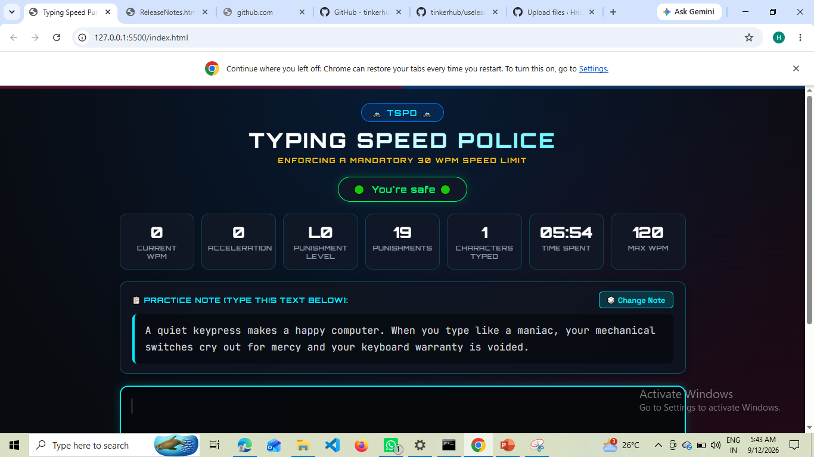
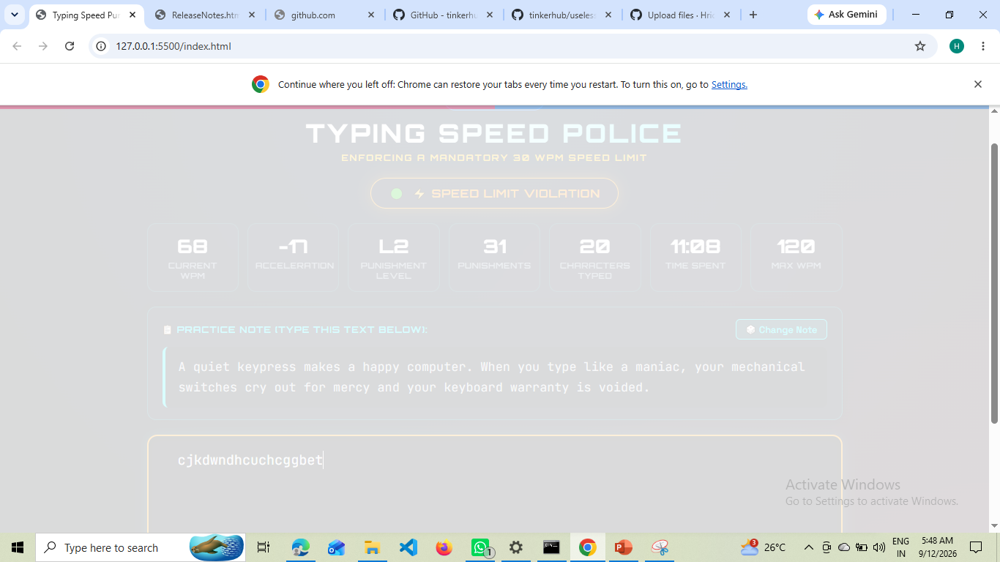
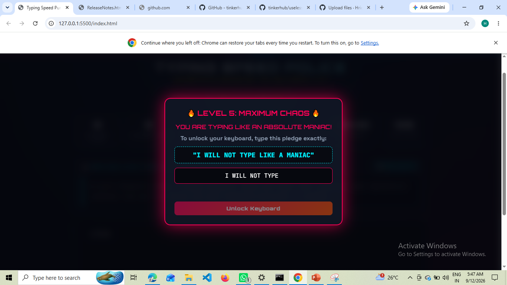

# Type Speed Punisher 🎯

### Team Member
- Team Lead: Hridya M K - College of Engineering Trikaripur

### Project Description
This is a type speed recognition and if the speed is high it 
 give the punishment according to the speed level in WPM.

### The Problem (that doesn't exist)
The problem is typing speed of most of the person is high.

### The Solution (that nobody asked for)
Reduce the type speed.

## Technical Details
### Technologies/Components Used
For Software:
- Languages used: html, css, javascript, python
- Frameworks used: none
- Libraries used: Web Audio API, Google Fonts
- Tools used: Visual Studio Code, Google Chrome, Git/GitHub

# Run
open index.html

### Project Documentation
For Software:

# Screenshots (Add at least 3)

typing-speed-punisher-dashboard

typing-speed-violation

level-5-maniac-lockdown

### Project Demo
# Video
Typing Speed Punisher - Speed Limit Police 🚓 - Google Chrome 

The video demonstrates the complete working of the Typing Speed Punisher
web application. It shows real-time WPM monitoring, punishment levels 
triggered by increasing typing speed, visual and sound effects, and the
Level 5 “Maximum Chaos” mode with typing lockdown and CAPTCHA.

## Team Contributions
- Hridya M K: Complete project building

---
Made with ❤️ at TinkerHub Useless Projects 

